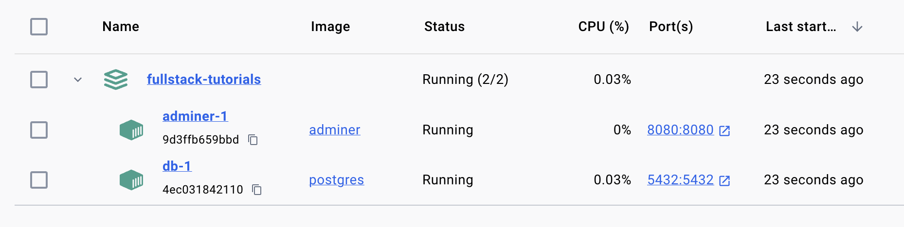

# Interact with Postgres without Writing Code

* **Interact with Postgres without writing code is very helpful when trying to inspect the data in the databases directly.**
* There are two main ways to interact with Postgres without writing code. One is using a GUI (Graphic User Interface), the other is through command line.

## Interact with Postgres Using GUI

Making sure `docker compose up` is running. if not, follow steps in this page:


[setup-postgres-locally-using-docker.md](setup-postgres-locally-using-docker.md)


Once you see:

```
LOG:  database system is ready to accept connections
```

in `docker compose up` output, or simply wait a little bit for the containers to fully start and ready to work.

Open your browser and open [http://localhost:8080](http://localhost:8080) page, you should be able see a web page that looks like:

<figure><figcaption></figcaption></figure>

This is the Adminer UI, which is the GUI that we will use to interact with Postgres.

## Step 1: Login

* In the System dropdown, select PostgreSQL.
* In Server input, enter `db`.
* In Username, enter `postgres`
* In Password, enter `example`
* In Database, enter `postgres`
* Check Permanent Login checkbox for convenience.

Click Login, it should then enter this view:

<figure><figcaption></figcaption></figure>

This means the login is successful.

## Step 2: (Optional) Create Schema


This step is for getting you familiar with features in Adminer.

Feel free to skip this step.


Navigate to SQL command page in the left sidebar. Enter create table SQL command:

```sql
create table example_books (
  id SERIAL PRIMARY KEY, 
  name VARCHAR NOT NULL,
  description VARCHAR
)
```

Click **Execute** button under the text box. You will see

<figure><figcaption></figcaption></figure>

which means the create table SQL command ran successfully.

If you click **Execute** again, you will see:

<figure><figcaption></figcaption></figure>

This is because the table "example\_books" is already created, which is expected here.

## Step 3: (Optional) Insert Records


This step is for getting you familiar with features in Adminer.

Feel free to skip this step.


In SQL command page, enter SQL command:

```sql
insert into example_books (name, description) 
values ('Fullstack Tutorials', 'A tutorial for fullstack development');
```

You should be able to see green text:

```
Query executed OK, 1 row affected.
```

Click **select** button on the side bar:

<figure><figcaption></figcaption></figure>

This will run `SELECT * FROM "example_books"` and show the result on the page. You should be able to see:

<figure><figcaption></figcaption></figure>

The record in the table is the record we just inserted.
